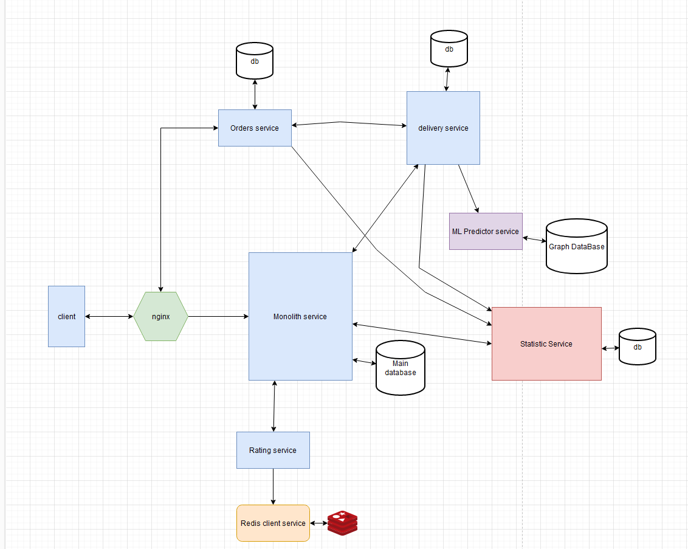

# Практическое задание №4

Практическое задание
На примере всей системы или отдельных ее узлов опишите, как можно внедрить следующие архитектурные паттерны:
1. Timeout/Retry(refresh)
2. Deadlines
3. Rate/Burst Limiting
4. Circuit breaker
5. Dummy(Failover)
6. Bulkhead

## Timeout/Retry:
Client и nginx: Если nginx не отвечает в течение определенного времени (timeout), client может автоматически повторить запрос (retry). Аналогично, Monolith Service может использовать timeout/retry при взаимодействии с Orders Service или Delivery Service.

## Deadlines:
Monolith Service может устанавливать deadlines для операций с ML Predictor Service и Statistic Service. Это означает, что операции должны быть завершены до определенного времени, иначе они будут отменены, чтобы избежать бесконечного ожидания.

## Rate/Burst Limiting:
nginx может контролировать количество запросов к Monolith Service с помощью rate limiting. Также может быть установлено burst limiting, позволяющее на короткое время принять больше запросов, но ограничивающее скорость их обработки в долгосрочной перспективе.

## Circuit Breaker:
Во взаимодействии между Monolith Service и Rating Service может быть использован circuit breaker. Если Rating Service часто не отвечает или отвечает с ошибками, circuit breaker прерывает запросы к этому сервису, позволяя ему восстановиться.

## Dummy (Failover):
Для баз данных, таких как Main Database и db у Statistic Service, может быть реализован механизм failover. При сбое основной базы данных запросы переключаются на резервную базу данных.

## Bulkhead:
Внутри Monolith Service можно реализовать разделение функций (bulkhead), таких как обработка заказов, доставка и оценка, на разные компоненты или ресурсы, чтобы сбой в одном не влиял на другие.
